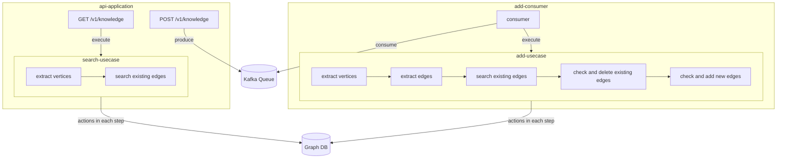

# Knowledge Base
This project is a graph-db based knowledge-base system.
This code extract and update knowledge leveraging llm with producer-consumer architecture.

## project structure
- app
  - add_consumer - entry point of `add_consumer` app
  - api - entry point of `api` app
- core
  - component: implemtation of port
  - entity
  - port: interface connecting outside and inside of core logic
  - prompt
  - service: combining ports, implements detail logic
  - usecase: business logic
- infra

## Design of actions

