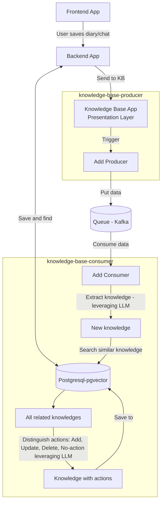
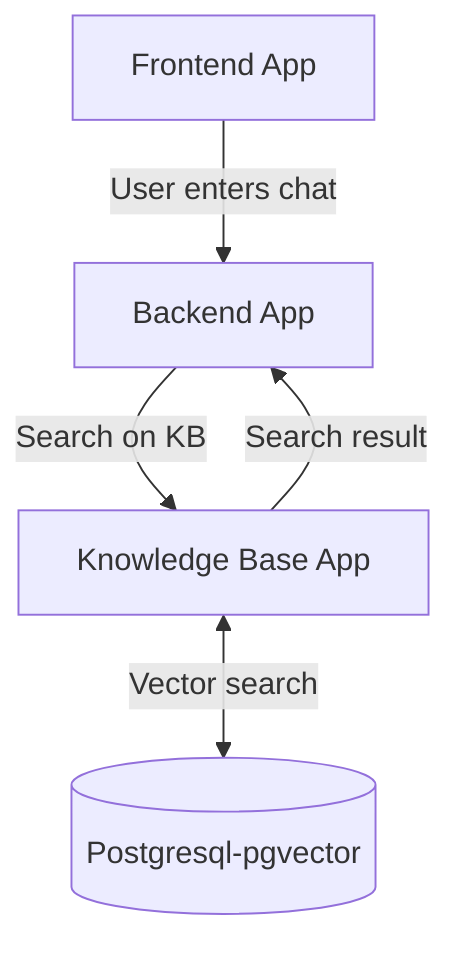

# Knowledge Base
This project is a knowledge base system for ai assistant for human-ai interactive diary application.  
  
## project structure
- core
    - components
    - domain
        - entity
            knowledge.py
        - usecase
            add_producer.py
            add_consumer.py
            search.py
- infra
    litellm
- present
    - search
    - add

## Design of actions
__Add: Save diary__  
Add action is triggered when user saves diary or enter chat messages to ai assistant.  
1. Data processing from backend app
2. Presentation layer of knowledge base app
3. Trigger add producer usecase
4. Producer puts the data into queue (kafka)
5. Consumer gets the data from the queue
    a. Extract knowledge leveraging LLM
    b. Search similar knowledge by vector search <-> pgvector store
    c. Distinguish add, update, and delete actions on knowledges
    d. Do the actions

  

__Search: Chat request__  
Search action is triggered when user enter chat messages to ai assistant
1. Data processing from backend app
2. Presentation layer of knowledge base app
3. Vector search on pgvector and retrieve top k knowledge
  
